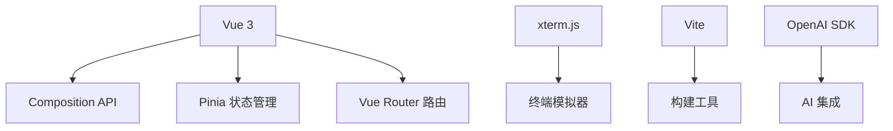
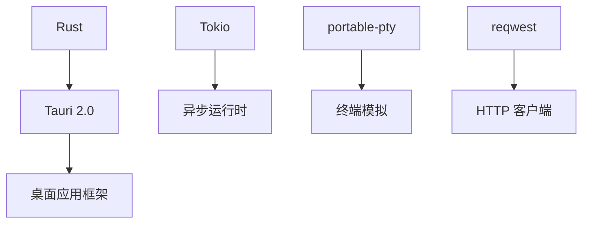

# Huaan Command 项目熟悉计划

## 项目概述

**Huaan Command** 是一个现代化的智能终端命令管理工具，集成了 AI 助手功能，支持并发任务执行和多终端管理。该项目采用 Tauri 2.0 + Vue 3 技术栈，提供跨平台桌面应用体验。

## 技术架构

### 前端技术栈


### 后端技术栈


## 核心功能模块

### 1. 智能终端系统
- **多标签终端管理**: 支持多个并发终端会话
- **AI 模式集成**: Ctrl+A 切换 AI 模式，自然语言生成命令
- **Warp 模式**: 现代化界面，@ 文件选择器
- **命令历史搜索**: Ctrl+R 反向搜索历史命令

### 2. 任务管理系统
- **并发执行**: 基于 Tokio 的真正异步并发，600% 性能提升
- **任务依赖**: 拓扑排序智能调度
- **批量操作**: 多选任务批量执行/取消/删除
- **实时监控**: 任务状态、输出、错误实时显示

### 3. AI 助手功能
- **多服务商支持**: OpenAI、DeepSeek、Kimi、智谱等
- **流式响应**: 实时显示 AI 回复，打字机效果
- **智能错误诊断**: 自动分析并解决命令错误
- **项目分析**: AI Agent 模式理解项目结构

### 4. 用户体验设计
- **多主题支持**: 6个预设主题 + 自定义颜色系统
- **响应式设计**: 适配不同屏幕尺寸
- **快捷键系统**: 全局快捷键管理
- **平滑动画**: 主题切换、界面交互流畅过渡

## 项目结构分析

### 前端目录结构
```
src/
├── components/          # Vue 组件
│   ├── TerminalPane.vue    # 终端面板
│   ├── AIChatPanel.vue     # AI 聊天面板
│   ├── TaskList.vue        # 任务列表
│   └── SettingsModal.vue   # 设置模态框
├── stores/              # Pinia 状态管理
│   ├── terminal.js         # 终端状态
│   ├── ai.js              # AI 状态
│   ├── task.js            # 任务状态
│   └── settings.js        # 设置状态
├── views/               # 页面组件
│   ├── Terminal.vue        # 终端页面
│   ├── Tasks.vue          # 任务页面
│   └── Settings.vue       # 设置页面
└── composables/         # 组合式函数
```

### 后端目录结构
```
src-tauri/src/
├── lib.rs              # 主库文件
├── terminal.rs         # 终端管理
├── task.rs            # 任务管理
├── ai_proxy.rs        # AI 代理
└── commands/          # Tauri 命令
```

## 关键技术实现

### 1. 终端管理
- 使用 `portable-pty` 创建真实的 PTY 会话
- 通过 Tauri 事件系统实现前后端通信
- 支持多个并发终端会话的独立管理

### 2. AI 集成
- 支持多个 AI 服务商的统一接口
- 流式响应处理，实时显示 AI 回复
- 上下文记忆和多轮对话支持

### 3. 任务并发执行
- 基于 Tokio 的异步任务调度
- 拓扑排序处理任务依赖关系
- 实时状态更新和错误处理

### 4. 状态管理
- Pinia 管理前端状态
- 持久化存储用户配置
- 响应式数据绑定

## 开发环境设置

### 环境要求
- Node.js 18+
- Rust 1.70+
- macOS / Linux / Windows

### 启动步骤
```bash
# 1. 克隆项目
git clone https://github.com/hua123an/huaan-command.git
cd huaan-command

# 2. 安装依赖
NODE_ENV=development npm install

# 3. 启动开发服务器
npm run tauri dev
# 或使用便捷脚本
./run.sh
```

## 快捷键系统

### 全局快捷键
| 快捷键 | 功能 |
|--------|------|
| `Ctrl+T` | 新建终端标签 |
| `Ctrl+A` | 切换 AI 模式 |
| `Ctrl+R` | 反向历史搜索 |
| `Ctrl+K` | 打开命令面板 |
| `Ctrl+,` | 打开设置 |

### AI 模式快捷键
| 快捷键 | 功能 |
|--------|------|
| `Enter` | 发送消息 |
| `Shift+Enter` | 换行 |
| `↑/↓` | 编辑历史消息 |
| `Escape` | 退出 AI 模式 |

## 核心特性亮点

### 1. Warp 模式 ⭐⭐⭐⭐⭐
- 现代化界面设计
- @ 文件选择器可视化操作
- 快速模型切换
- 实时状态显示

### 2. 并发任务执行
- 600% 性能提升 vs 顺序执行
- 真正的异步并发
- 智能依赖调度

### 3. AI 多服务商支持
- 8+ AI 服务商集成
- 统一接口设计
- 流式响应体验

### 4. 主题系统
- 6个精心设计的预设主题
- 完全可定制的色彩系统
- 平滑过渡动画

## 项目文档结构

### 核心文档
- `README.md` - 项目概述和快速开始
- `FEATURES_COMPLETE.md` - 完整功能文档
- `DEVELOPMENT_GUIDE.md` - 开发者指南
- `AI_COMPLETE_GUIDE.md` - AI 功能使用指南

### 技术文档
- `AI_TECHNICAL_REFERENCE.md` - AI 技术实现
- `PERFORMANCE_OPTIMIZATION.md` - 性能优化指南
- `TERMINAL_PERSISTENCE.md` - 终端持久化
- `WARP_MODE.md` - Warp 模式详解

## 学习路径建议

### 第一阶段：基础了解
1. 阅读 `README.md` 了解项目概述
2. 运行项目，体验核心功能
3. 熟悉快捷键和基本操作

### 第二阶段：功能深入
1. 阅读 `FEATURES_COMPLETE.md` 了解所有功能
2. 测试 AI 模式和任务管理
3. 体验 Warp 模式和主题系统

### 第三阶段：技术架构
1. 阅读 `DEVELOPMENT_GUIDE.md` 了解开发流程
2. 分析前端 Vue 组件结构
3. 理解后端 Rust 模块设计

### 第四阶段：高级特性
1. 深入 AI 集成机制
2. 理解并发任务调度
3. 学习终端持久化实现

## 总结

Huaan Command 是一个技术先进、功能丰富的智能终端工具，具有以下特点：

- **现代化技术栈**: Tauri 2.0 + Vue 3 + Rust
- **智能化体验**: AI 助手深度集成
- **高性能**: 异步并发任务执行
- **用户友好**: 精美 UI 和流畅交互
- **可扩展性**: 模块化架构设计

该项目展示了桌面应用开发的最佳实践，是学习现代跨平台应用开发的优秀案例。