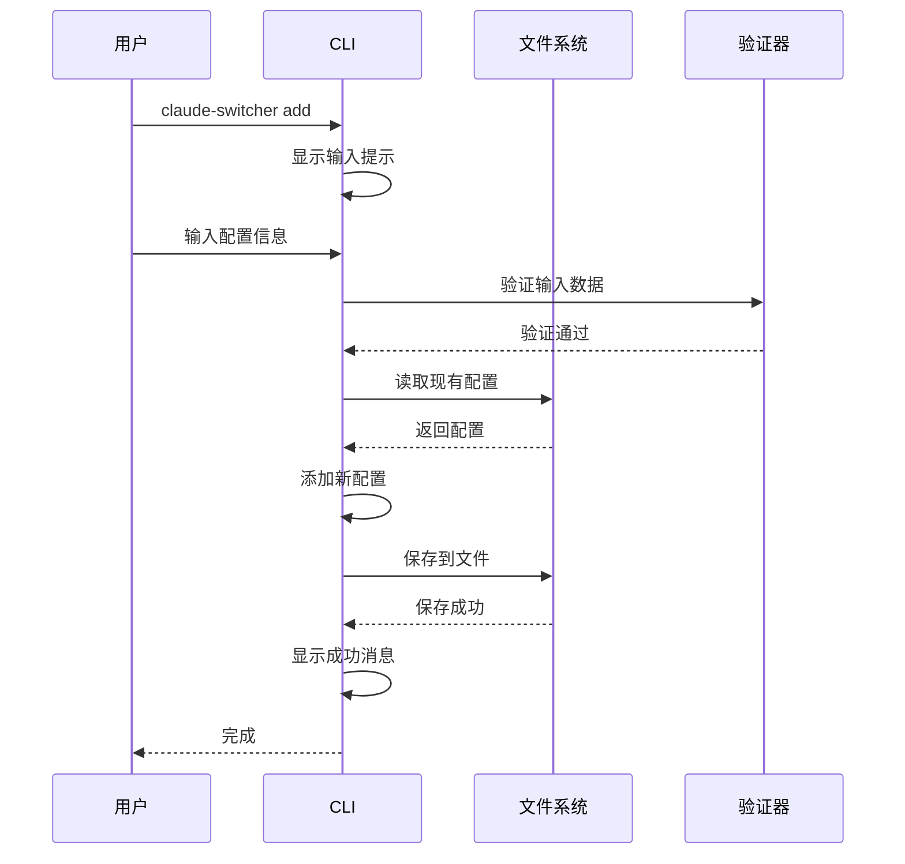
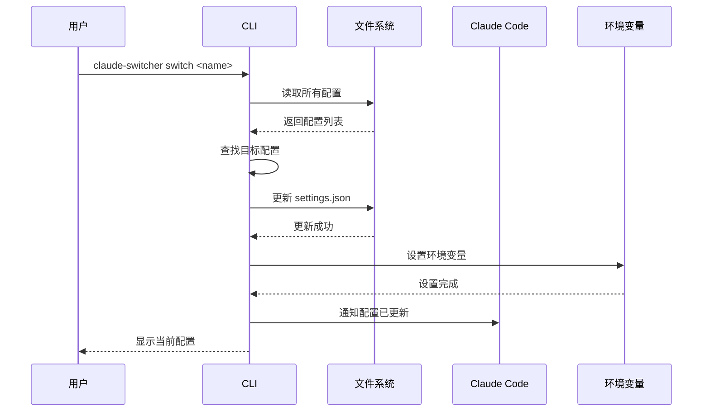

# Claude Code 配置切换工具 - 架构说明

## 📋 概述

Claude Code 配置切换工具是一个轻量级的命令行工具，采用模块化架构设计，实现了配置管理、CLI 交互和 Claude Code 集成的完整功能。

---

## 🏗️ 整体架构

### 架构图

```
┌─────────────────────────────────────────────────────────┐
│                   用户接口层                              │
├─────────────────────────────────────────────────────────┤
│  ┌─────────────┐ ┌─────────────┐ ┌─────────────┐         │
│  │   命令行    │ │  交互模式   │ │   帮助系统   │         │
│  └─────────────┘ └─────────────┘ └─────────────┘         │
└───────────────────────┬─────────────────────────────────┘
                        │
┌───────────────────────▼─────────────────────────────────┐
│                   业务逻辑层                              │
├─────────────────────────────────────────────────────────┤
│  ┌─────────────┐ ┌─────────────┐ ┌─────────────┐         │
│  │  配置管理   │ │  服务商操作 │ │   数据验证   │         │
│  │    模块     │ │    模块     │ │    模块     │         │
│  └─────────────┘ └─────────────┘ └─────────────┘         │
└───────────────────────┬─────────────────────────────────┘
                        │
┌───────────────────────▼─────────────────────────────────┐
│                   数据访问层                              │
├─────────────────────────────────────────────────────────┤
│  ┌─────────────┐ ┌─────────────┐ ┌─────────────┐         │
│  │  文件系统   │ │   JSON      │ │   配置管理   │         │
│  │    操作     │ │   解析      │ │             │         │
│  └─────────────┘ └─────────────┘ └─────────────┘         │
└─────────────────────────────────────────────────────────┘
                        │
┌───────────────────────▼─────────────────────────────────┐
│                   外部集成层                              │
├─────────────────────────────────────────────────────────┤
│  ┌─────────────┐ ┌─────────────┐ ┌─────────────┐         │
│  │   Claude    │ │  环境变量   │ │    系统      │         │
│  │    Code     │ │   设置      │ │    配置      │         │
│  └─────────────┘ └─────────────┘ └─────────────┘         │
└─────────────────────────────────────────────────────────┘
```

---

## 📁 模块结构

### 1. 主程序文件 (claude-config-switcher.js)

#### 文件大小
约 600 行代码，~13KB

#### 模块划分

```
claude-config-switcher.js
│
├── 头部注释和文档 (1-30)
│   ├── 文件描述
│   ├── 许可证
│   └── 使用说明
│
├── 常量和配置 (31-80)
│   ├── 配置文件路径常量
│   ├── ANSI 颜色代码
│   ├── 默认配置值
│   └── 工具元信息
│
├── 工具函数 (81-150)
│   ├── 文件操作函数
│   │   ├── readConfig()
│   │   ├── writeConfig()
│   │   ├── ensureConfigFile()
│   │   └── backupConfig()
│   ├── 数据处理函数
│   │   ├── validateProvider()
│   │   ├── formatProvider()
│   │   └── sanitizeApiKey()
│   ├── 格式化输出函数
│   │   ├── printMessage()
│   │   ├── printProviderList()
│   │   ├── printProvider()
│   │   └── printError()
│   └── 通用工具函数
│       ├── isValidUrl()
│       ├── maskApiKey()
│       └── getTimestamp()
│
├── 配置管理模块 (151-280)
│   ├── loadAllProviders()     - 加载所有配置
│   ├── saveProvider()         - 保存单个配置
│   ├── updateProvider()       - 更新配置
│   ├── deleteProvider()       - 删除配置
│   ├── getProvider()          - 获取单个配置
│   └── validateConfigFormat() - 验证配置格式
│
├── Claude Code 集成模块 (281-380)
│   ├── updateClaudeSettings() - 更新 settings.json
│   ├── readClaudeSettings()   - 读取 settings.json
│   ├── setEnvironmentVars()   - 设置环境变量
│   └── launchClaudeCode()     - 启动 Claude Code
│
├── 交互式输入模块 (381-450)
│   ├── promptUser()           - 提示用户输入
│   ├── getProviderInput()     - 获取服务商信息
│   ├── getSwitchChoice()      - 获取切换选择
│   └── confirmAction()        - 确认操作
│
├── 命令处理模块 (451-530)
│   ├── handleAdd()            - 处理 add 命令
│   ├── handleList()           - 处理 list 命令
│   ├── handleSwitch()         - 处理 switch 命令
│   ├── handleRemove()         - 处理 remove 命令
│   ├── handleShow()           - 处理 show 命令
│   └── handleHelp()           - 处理 help 命令
│
├── 交互式菜单模块 (531-580)
│   ├── interactiveMenu()      - 主菜单
│   ├── menuList()             - 列表菜单项
│   ├── menuAdd()              - 添加菜单项
│   ├── menuSwitch()           - 切换菜单项
│   ├── menuRemove()           - 删除菜单项
│   └── menuShow()             - 显示菜单项
│
└── 主程序入口 (581-600)
    ├── 参数解析
    ├── 命令路由
    └── 错误处理
```

---

## 🔄 数据流

### 配置添加流程



### 配置切换流程



---

## 🎨 设计模式

### 1. 模块模式 (Module Pattern)
```javascript
const ConfigManager = (() => {
  // 私有变量
  let configData = null;

  // 私有方法
  const loadFile = () => { /* ... */ };

  // 公共接口
  return {
    load: () => { /* ... */ },
    save: (data) => { /* ... */ },
    add: (provider) => { /* ... */ },
    remove: (name) => { /* ... */ }
  };
})();
```

### 2. 命令模式 (Command Pattern)
```javascript
// 每个命令都是独立的函数
const commands = {
  add: handleAdd,
  list: handleList,
  switch: handleSwitch,
  remove: handleRemove,
  show: handleShow,
  interactive: handleInteractive,
  help: handleHelp
};
```

### 3. 策略模式 (Strategy Pattern)
```javascript
// 不同的验证策略
const validators = {
  url: isValidUrl,
  apiKey: isValidApiKey,
  name: isValidName,
  model: isValidModel
};
```

### 4. 观察者模式 (Observer Pattern)
```javascript
// 配置变更时的通知机制
const listeners = [];
const notifyChange = (event) => {
  listeners.forEach(listener => listener(event));
};
```

---

## 💾 数据模型

### Provider 配置对象

```javascript
{
  name: String,          // 服务商标识符 (必填)
  baseUrl: String,       // API Base URL (必填)
  apiKey: String,        // API Key (必填)
  model: String,         // 模型名称 (必填)
  createdAt: String,     // 创建时间 (自动生成)
  updatedAt: String      // 更新时间 (自动生成，可选)
}
```

### 配置集合对象

```javascript
{
  version: String,       // 配置版本
  providers: [           // 服务商列表
    Provider,
    Provider,
    ...
  ],
  activeProvider: String, // 当前激活的提供商
  lastModified: String    // 最后修改时间
}
```

### Claude Code 设置对象

```javascript
{
  model: String,                    // 当前模型
  activeProvider: String,           // 当前提供商
  env: {
    ANTHROPIC_API_KEY: String,      // API Key
    ANTHROPIC_BASE_URL: String      // Base URL
  }
}
```

---

## 🔧 核心算法

### 1. 配置查找算法
```javascript
function findProvider(providers, name) {
  return providers.find(p => p.name.toLowerCase() === name.toLowerCase());
}

// 时间复杂度: O(n)
// 空间复杂度: O(1)
```

### 2. 配置去重算法
```javascript
function deduplicateProviders(providers) {
  const seen = new Set();
  return providers.filter(p => {
    const key = p.name.toLowerCase();
    if (seen.has(key)) {
      return false;
    }
    seen.add(key);
    return true;
  });
}

// 时间复杂度: O(n)
// 空间复杂度: O(n)
```

### 3. 配置排序算法
```javascript
function sortProviders(providers) {
  return providers.sort((a, b) => {
    // 按创建时间倒序
    return new Date(b.createdAt) - new Date(a.createdAt);
  });
}

// 时间复杂度: O(n log n)
// 空间复杂度: O(n)
```

---

## 📦 依赖关系

### Node.js 内置模块

```
依赖模块列表 (共 4 个):
│
├── fs (文件系统)
│   ├── 文件读取
│   ├── 文件写入
│   ├── 文件备份
│   └── 目录检查
│
├── path (路径处理)
│   ├── 路径拼接
│   ├── 路径解析
│   └── 用户目录获取
│
├── os (操作系统)
│   ├── 用户主目录
│   ├── 平台检测
│   └── 临时文件
│
└── readline (交互输入)
    ├── 用户提示
    ├── 输入读取
    ├── 行处理
    └── 交互菜单
```

### 零外部依赖

- ✅ 无 NPM 包依赖
- ✅ 无第三方库
- ✅ 仅使用 Node.js 核心模块
- ✅ 轻量级安装包 (~13KB)

---

## 🔐 安全架构

### 1. 数据保护

#### API Key 脱敏
```javascript
function maskApiKey(apiKey) {
  if (!apiKey || apiKey.length < 8) {
    return '***';
  }
  const start = apiKey.substring(0, 4);
  const end = apiKey.substring(apiKey.length - 4);
  return `${start}...${end}`;
}
```

#### 文件权限控制
```javascript
function secureFile(filePath) {
  // 设置仅所有者可读写 (600)
  fs.chmodSync(filePath, 0o600);
}
```

### 2. 输入验证

#### URL 验证
```javascript
function isValidUrl(url) {
  try {
    const parsed = new URL(url);
    return parsed.protocol === 'http:' || parsed.protocol === 'https:';
  } catch {
    return false;
  }
}
```

#### 配置完整性检查
```javascript
function validateProvider(provider) {
  return (
    provider.name &&
    provider.baseUrl &&
    provider.apiKey &&
    provider.model &&
    isValidUrl(provider.baseUrl)
  );
}
```

---

## 🚀 性能优化

### 1. 文件 I/O 优化

#### 批量写入
```javascript
// 合并多次写入为一次
const buffer = [];
function queueWrite(data) {
  buffer.push(data);
  if (buffer.length >= 10) {
    flushBuffer();
  }
}
```

#### 懒加载
```javascript
let configCache = null;
function getConfig() {
  if (!configCache) {
    configCache = readConfig();
  }
  return configCache;
}
```

### 2. 内存优化

#### 及时释放
```javascript
function processProviders(providers) {
  const result = providers.map(p => ({ ...p }));
  providers = null; // 释放引用
  return result;
}
```

#### 对象复用
```javascript
// 重用对象而不是创建新对象
const template = {
  name: '',
  baseUrl: '',
  apiKey: '',
  model: '',
  createdAt: ''
};

function createProvider(data) {
  return { ...template, ...data };
}
```

---

## 🔍 错误处理

### 错误分类

#### 1. 系统错误
- 文件读写失败
- 权限不足
- 磁盘空间不足

#### 2. 业务错误
- 配置不存在
- 配置重复
- 无效输入

#### 3. 用户错误
- 错误的命令参数
- 取消操作
- 输入超时

### 错误处理策略

```javascript
function handleError(error, context) {
  switch (error.type) {
    case 'FILE_NOT_FOUND':
      printError(`配置文件不存在: ${error.path}`);
      printMessage('运行 "claude-switcher add" 创建配置');
      break;

    case 'INVALID_CONFIG':
      printError('配置文件格式错误');
      printMessage('建议删除后重新创建');
      break;

    case 'PROVIDER_NOT_FOUND':
      printError(`找不到配置: ${error.name}`);
      printMessage('使用 "claude-switcher list" 查看所有配置');
      break;

    default:
      printError(`未知错误: ${error.message}`);
      printMessage('请查看文档或提交 Issue');
  }
}
```

---

## 📊 监控和日志

### 输出日志级别

```javascript
const logLevels = {
  DEBUG: 0,
  INFO: 1,
  WARN: 2,
  ERROR: 3
};

function printLog(level, message) {
  if (level >= currentLogLevel) {
    console[getLevelName(level)](message);
  }
}
```

### 敏感信息过滤

```javascript
// 日志输出时自动过滤敏感信息
function safeLog(data) {
  const json = JSON.stringify(data);
  const masked = json.replace(/"apiKey":\s*"[^"]+"/g, '"apiKey":"***"');
  return JSON.parse(masked);
}
```

---

## 🧪 测试策略

### 单元测试

#### 配置管理测试
```javascript
// 测试配置 CRUD 操作
test('addProvider - should add new provider', () => {
  const config = { providers: [] };
  const provider = { name: 'test', baseUrl: '...', apiKey: '...', model: '...' };
  addProvider(config, provider);
  assert(config.providers.length === 1);
});
```

#### 输入验证测试
```javascript
// 测试验证函数
test('isValidUrl - should validate URLs', () => {
  assert(isValidUrl('https://api.example.com') === true);
  assert(isValidUrl('invalid-url') === false);
  assert(isValidUrl('http://localhost:8000') === true);
});
```

### 集成测试

#### 完整流程测试
```javascript
test('full workflow - add and switch provider', () => {
  // 1. 添加配置
  // 2. 列出配置
  // 3. 切换配置
  // 4. 验证切换结果
});
```

---

## 🔮 扩展性设计

### 1. 新增命令

```javascript
// 注册新命令
function registerCommand(name, handler, description) {
  commands[name] = handler;
  helpText[name] = description;
}
```

### 2. 新增验证器

```javascript
// 添加新的验证规则
validators.email = isValidEmail;
validators.custom = validateCustomRule;
```

### 3. 插件系统

```javascript
// 插件接口
class Plugin {
  name() { return 'plugin-name'; }
  init(app) { /* 初始化插件 */ }
  destroy() { /* 清理资源 */ }
}
```

---

## 📈 版本演进

### v1.0.0 (当前)
- 基础配置管理
- 命令行接口
- 交互式菜单
- Claude Code 集成

### v2.0.0 (计划)
- 配置验证
- 备份/恢复
- 导入/导出
- 快捷键支持

### v3.0.0 (规划)
- Web UI
- 云同步
- 团队协作
- 企业功能

---

## 🎓 学习要点

### 核心概念

1. **模块化设计**
   - 单一职责原则
   - 高内聚低耦合
   - 接口抽象

2. **文件操作**
   - 同步 vs 异步
   - 错误处理
   - 权限管理

3. **用户交互**
   - readline 异步编程
   - 菜单导航
   - 输入验证

4. **配置管理**
   - JSON 数据结构
   - 版本控制
   - 数据迁移

---

## 📚 相关资源

- [Node.js 文档](https://nodejs.org/docs/)
- [JavaScript 设计模式](https://addyosmani.com/resources/essentialjsdesignpatterns/book/)
- [Node.js 最佳实践](https://github.com/goldbergyoni/nodebestpractices)

---

## 🔗 相关文档

- [README.md](./README.md) - 完整使用说明
- [GETTING_STARTED.md](./GETTING_STARTED.md) - 快速开始
- [CONTRIBUTING.md](./CONTRIBUTING.md) - 贡献指南
- [SECURITY.md](./SECURITY.md) - 安全说明

---

**希望这份架构说明能帮助你更好地理解项目！** 🚀
